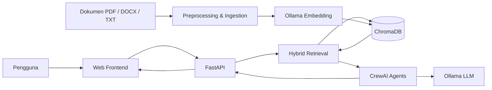

# Dokumentasi Proyek

## ICS SOP & Knowledge Assistant

| Informasi | Detail |
| --- | --- |
| Nama Proyek | ICS SOP & Knowledge Assistant |
| Jenis Sistem | Asisten pengetahuan internal berbasis Retrieval-Augmented Generation (RAG) |
| Versi Dokumen | 1.0 |
| Tanggal Dokumen | 29 Juni 2026 |
| Status | Dokumentasi Umum |
| Lingkup Penggunaan | Internal |

---

## 1. Ringkasan Eksekutif

ICS SOP & Knowledge Assistant adalah aplikasi internal yang membantu pengguna menemukan informasi dari dokumen kebijakan, prosedur, pedoman, dan materi operasional perusahaan melalui percakapan bahasa alami.

Sistem menggunakan pendekatan Retrieval-Augmented Generation (RAG). Ketika pengguna mengajukan pertanyaan, aplikasi mencari bagian dokumen yang paling relevan terlebih dahulu, kemudian menggunakan model bahasa untuk menyusun jawaban berdasarkan informasi tersebut. Jawaban dilengkapi citation yang menunjukkan file sumber, pasal, dan halaman PDF agar informasi dapat diverifikasi kembali.

Seluruh komponen utama dapat dijalankan secara lokal. Model bahasa dan embedding disediakan melalui Ollama, sedangkan penyimpanan vektor menggunakan ChromaDB. Pendekatan ini membantu menjaga dokumen internal tetap berada di lingkungan yang dikendalikan organisasi.

## 2. Latar Belakang

Dokumen internal perusahaan umumnya tersebar dalam beberapa file dan memiliki struktur yang cukup panjang. Pengguna harus mengetahui nama dokumen, lokasi file, atau istilah yang tepat untuk menemukan informasi yang dibutuhkan. Proses tersebut dapat memakan waktu dan berpotensi menghasilkan interpretasi yang tidak konsisten.

Proyek ini dikembangkan untuk menyediakan satu antarmuka pencarian berbasis percakapan. Pengguna dapat mengajukan pertanyaan secara langsung tanpa harus membuka dan membaca setiap dokumen satu per satu.

## 3. Tujuan Proyek

Tujuan utama proyek ini adalah:

- Mempercepat pencarian informasi pada dokumen internal.
- Menyediakan jawaban yang mudah dibaca dan tetap terhubung dengan sumber resmi.
- Mengurangi kebutuhan pencarian manual pada banyak file.
- Menyediakan akses terpusat terhadap dokumen yang telah diindeks.
- Mendukung pengoperasian lokal untuk menjaga kontrol terhadap data internal.
- Menyediakan fondasi yang dapat dikembangkan untuk kebutuhan knowledge management berikutnya.

## 4. Ruang Lingkup

### 4.1 Termasuk dalam Ruang Lingkup

- Membaca dokumen berformat PDF, DOCX, dan TXT.
- Memecah dokumen menjadi bagian yang lebih kecil berdasarkan struktur dan pasal.
- Membuat embedding dan menyimpannya pada vector database lokal.
- Mencari potongan dokumen yang relevan terhadap pertanyaan pengguna.
- Menghasilkan jawaban dalam bahasa Indonesia menggunakan model bahasa lokal.
- Menampilkan citation berupa nama file, pasal, dan halaman.
- Menyediakan halaman Chat, FAQ, dan Policy Library.
- Menyediakan tautan untuk membuka atau mengunduh dokumen sumber.

### 4.2 Di Luar Ruang Lingkup

- Sistem tidak menyimpan database profil atau data pribadi karyawan.
- Sistem tidak melakukan persetujuan administratif atau mengambil keputusan HR.
- Sistem tidak menggantikan dokumen resmi maupun otoritas pemilik kebijakan.
- Sistem belum menyediakan autentikasi, otorisasi berbasis peran, atau integrasi HRIS.
- Sistem belum ditujukan sebagai layanan publik atau deployment berskala besar.

## 5. Gambaran Solusi

Sistem terdiri dari dua proses utama: ingestion dan question answering.

### 5.1 Proses Ingestion

Proses ingestion menyiapkan dokumen agar dapat dicari secara semantik. Dokumen dibaca dari direktori sumber, dipisahkan berdasarkan bagian atau pasal, dipecah menjadi chunk, diubah menjadi embedding, lalu disimpan ke ChromaDB.

### 5.2 Proses Question Answering

Pertanyaan pengguna dicocokkan dengan chunk yang tersimpan. Sistem memilih evidence yang paling relevan, meneruskannya ke CrewAI, lalu menghasilkan jawaban dengan citation. Frontend menampilkan jawaban, sumber, dan waktu pemrosesan kepada pengguna.

## 6. Arsitektur Umum



### 6.1 Komponen Utama

| Komponen | Fungsi |
| --- | --- |
| Web Frontend | Menyediakan antarmuka Chat, FAQ, dan Policy Library. |
| FastAPI | Menyediakan API, menghubungkan frontend dengan pipeline AI, dan menyajikan file statis. |
| Preprocessing | Membaca, menormalisasi, dan memecah dokumen menjadi chunk. |
| Ollama Embedding | Mengubah teks menjadi representasi vektor. |
| ChromaDB | Menyimpan embedding, isi chunk, dan metadata dokumen. |
| Hybrid Retrieval | Menggabungkan pencarian semantik dengan kecocokan istilah dan metadata. |
| CrewAI | Mengatur agent untuk menyeleksi evidence dan menulis jawaban akhir. |
| Ollama LLM | Menjalankan model bahasa secara lokal. |

## 7. Fitur Utama

### 7.1 Chat Berbasis Dokumen

Pengguna dapat mengajukan pertanyaan menggunakan bahasa alami. Sistem menampilkan jawaban, citation, dan durasi pemrosesan. Riwayat percakapan disimpan sementara pada browser dan dapat dihapus menggunakan tombol **New chat**.

### 7.2 Citation Sumber

Setiap jawaban dapat menyertakan marker citation yang terhubung dengan informasi berikut:

- Nama file dokumen.
- Pasal atau bagian dokumen.
- Nomor halaman PDF.
- Tautan menuju dokumen sumber.

### 7.3 Frequently Asked Questions

Halaman FAQ berisi pertanyaan umum yang disusun berdasarkan kebijakan yang tersedia. Pengguna dapat membaca jawaban singkat, memeriksa sumber, atau meneruskan pertanyaan ke halaman Chat.

### 7.4 Policy Library

Policy Library menampilkan dokumen yang tersedia pada direktori sumber. Pengguna dapat melakukan filter dan membuka dokumen secara langsung.

### 7.5 Ingestion Otomatis

Script Windows memeriksa keberadaan vector database berdasarkan `CHROMA_DIR` di `.env`. Jika index aktif belum valid, sistem menjalankan ingestion sebelum membuka aplikasi.

## 8. Alur Penggunaan

### 8.1 Menambahkan Dokumen

1. Administrator menempatkan dokumen pada direktori `backend/data`.
2. Proses ingestion dijalankan.
3. Sistem membaca isi dan metadata dokumen.
4. Dokumen dipecah menjadi chunk berdasarkan struktur pasal.
5. Embedding dibuat dan disimpan ke ChromaDB.
6. Dokumen siap digunakan dalam pencarian.

### 8.2 Mengajukan Pertanyaan

1. Pengguna memasukkan pertanyaan pada halaman Chat.
2. FastAPI menerima pertanyaan melalui endpoint `/query`.
3. Hybrid retrieval memilih chunk yang paling relevan.
4. Agent pertama menyeleksi evidence yang sesuai.
5. Agent kedua menyusun jawaban bahasa Indonesia.
6. API mengembalikan jawaban dan citation.
7. Frontend menampilkan hasil dan durasi pemrosesan.

## 9. Teknologi

| Teknologi | Penggunaan |
| --- | --- |
| Python | Bahasa utama backend dan pipeline AI. |
| FastAPI | REST API dan web server. |
| CrewAI | Orkestrasi agent. |
| LangChain | Loader dokumen, text splitter, dan integrasi vector store. |
| ChromaDB | Vector database lokal. |
| Ollama | Penyedia model LLM dan embedding lokal. |
| Vanilla HTML, CSS, JavaScript | Antarmuka web tanpa framework frontend tambahan. |
| Uvicorn | ASGI server untuk menjalankan FastAPI. |

## 10. Konfigurasi Utama

Konfigurasi dapat diatur melalui file `.env` dengan mengacu pada `.env.example`.

| Variabel | Keterangan | Nilai Default |
| --- | --- | --- |
| `MODEL` | Model bahasa yang digunakan untuk jawaban. | `ollama/gemma3:12b` |
| `OLLAMA_BASE_URL` | Alamat layanan Ollama. | `http://localhost:11434` |
| `EMBED_MODEL` | Model embedding dokumen. | `aroxima/multilingual-e5-large-instruct` |
| `RERANK_MODEL` | Model reranker untuk mengurutkan kandidat hasil retrieval. | `cross-encoder/mmarco-mMiniLMv2-L12-H384-v1` |
| `OLLAMA_NUM_CTX` | Panjang konteks Ollama untuk prompt jawaban. | `4096` |
| `OLLAMA_NUM_PREDICT` | Batas token output untuk jawaban chat. | `900` |
| `FAQ_NUM_PREDICT` | Batas token output untuk jawaban FAQ. | `220` |
| `OLLAMA_TIMEOUT_SECONDS` | Timeout request ke Ollama untuk proses generasi jawaban. | `240` |
| `CHROMA_DIR` | Lokasi penyimpanan vector database. | `backend/chroma_db` |
| `DATA_DIR` | Lokasi dokumen sumber. | `backend/data` |
| `TOP_K` | Jumlah chunk teratas yang diambil. | `4` |

## 11. Cara Menjalankan

### 11.1 Persyaratan

- Sistem operasi Windows untuk penggunaan script `.bat`.
- Python yang kompatibel dengan dependency proyek.
- Ollama dalam keadaan aktif.
- Model LLM dan embedding telah tersedia pada Ollama.
- Dependency pada `requirements.txt` telah terpasang.

### 11.2 Menjalankan Aplikasi

Cara paling sederhana adalah menjalankan:

```bat
run.bat
```

Script akan memeriksa environment, mencari port yang tersedia, membaca lokasi data dari `.env`, menjalankan ingestion hanya bila vector index belum valid, membuka browser, dan menjalankan FastAPI pada terminal aktif.

### 11.3 Membersihkan File Generated

```bat
clean.bat
```

Perintah tersebut membersihkan cache Python tanpa menghapus vector database. Gunakan `clean.bat /vectors` bila memang ingin menghapus embedding dan memaksa ingestion ulang.

## 12. Keamanan dan Tata Kelola

- Dokumen dan model diproses pada lingkungan lokal secara default.
- Dokumen sumber tetap menjadi acuan utama atas setiap jawaban.
- Citation membantu pengguna melakukan pemeriksaan terhadap informasi yang diberikan.
- Akses terhadap direktori data dan aplikasi harus dibatasi sesuai kebijakan organisasi.
- Dokumen sensitif tidak boleh dipublikasikan melalui server yang dapat diakses tanpa kontrol.
- Jika sistem dikembangkan untuk produksi, autentikasi, otorisasi, audit log, dan enkripsi komunikasi perlu ditambahkan.

## 13. Batasan Sistem

- Kualitas jawaban bergantung pada kualitas dan kelengkapan dokumen sumber.
- Model bahasa tetap dapat menghasilkan jawaban yang kurang tepat atau tidak lengkap.
- Citation menunjukkan evidence yang digunakan, tetapi pengguna tetap perlu memeriksa dokumen resmi untuk keputusan penting.
- Dokumen hasil scan tanpa lapisan teks belum didukung tanpa proses OCR tambahan.
- Perubahan dokumen baru tersedia setelah proses ingestion dijalankan kembali.
- Waktu respons dipengaruhi oleh perangkat keras, ukuran model, dan jumlah task agent.
- Penyimpanan riwayat chat saat ini terbatas pada browser pengguna.

## 14. Pemeliharaan

Pemeliharaan rutin meliputi:

- Memperbarui dokumen sumber ketika kebijakan berubah.
- Menjalankan ingestion setelah penambahan atau perubahan dokumen.
- Memeriksa hasil citation secara berkala.
- Memantau kompatibilitas versi dependency.
- Meninjau kualitas retrieval ketika jumlah dokumen bertambah.
- Melakukan pengujian terhadap pertanyaan umum dan pertanyaan yang tidak memiliki jawaban.

## 15. Pengembangan Lanjutan

Beberapa pengembangan yang dapat dipertimbangkan:

- Evaluasi otomatis untuk faithfulness dan relevansi jawaban.
- Autentikasi dan otorisasi berbasis peran.
- Integrasi dengan HRIS atau document management system.
- OCR untuk dokumen hasil scan.
- Dashboard pengelolaan dokumen dan status ingestion.
- Streaming jawaban untuk meningkatkan pengalaman pengguna.
- Logging, tracing, dan monitoring performa model.
- Dukungan percakapan multi-turn dengan context management yang terkontrol.

## 16. Penutup

ICS SOP & Knowledge Assistant menyediakan fondasi pencarian pengetahuan internal yang praktis, terpusat, dan dapat diverifikasi. Sistem menggabungkan pencarian dokumen dengan kemampuan model bahasa tanpa menghilangkan peran dokumen resmi sebagai sumber kebenaran utama.

Dengan peningkatan pada keamanan, evaluasi, dan integrasi sistem, proyek ini dapat dikembangkan menjadi platform knowledge assistant internal yang lebih luas.
