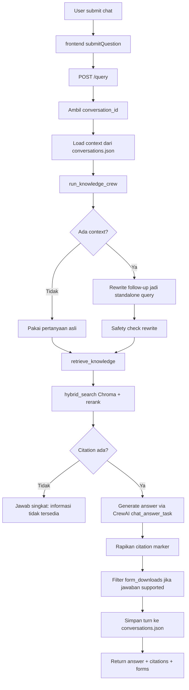
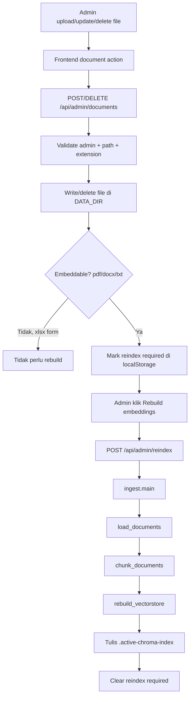
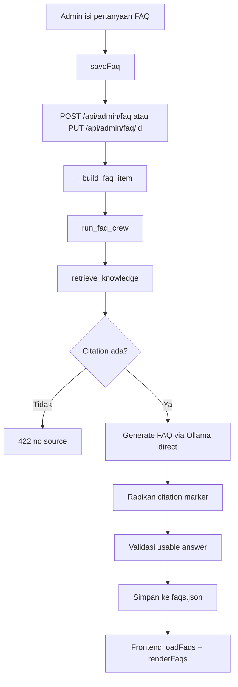
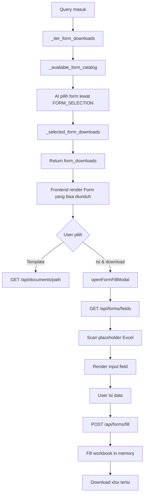

# System Flows Capstone

Dokumen ini dibuat sebagai peta cepat untuk ngecek alur sistem. Formatnya sengaja dibuat singkat: diagram dulu, lalu tabel fungsi lengkap dengan lokasi file dan line.

> Catatan: MCP `drawio` sudah di-add secara global lewat `codex mcp add drawio -- npx -y @drawio/mcp`. Diagram di file ini tetap pakai Mermaid supaya bisa langsung dibaca di Markdown tanpa restart tool.

## 1. Chat RAG dan Context Switching

### Diagram

### Fungsi dan lokasi

| Step | Fungsi | Lokasi |
|---|---|---|
| Submit chat dari frontend | `submitQuestion()` | `frontend/web/assets/app.js:396` |
| Endpoint chat | `query_knowledge_base()` | `backend/api/main.py:690` |
| Ambil context | `_get_conversation_context()` | `backend/api/main.py:478` |
| Simpan turn | `_append_conversation_turn()` | `backend/api/main.py:492` |
| Rewrite follow-up | `_rewrite_query()` | `backend/researcher_crew/src/researcher_crew/main.py:142` |
| Safety rewrite | `_rewrite_is_safe()` | `backend/researcher_crew/src/researcher_crew/main.py:122` |
| Orkestrasi RAG chat | `run_knowledge_crew()` | `backend/researcher_crew/src/researcher_crew/main.py:235` |
| Retrieval evidence | `retrieve_knowledge()` | `backend/researcher_crew/src/researcher_crew/tools/custom_tool.py:27` |
| Vector search/rerank | `hybrid_search()` | `backend/preprocessing/vectorstore.py:110` |
| Generate jawaban | `_generate_answer()` | `backend/researcher_crew/src/researcher_crew/main.py:196` |
| CrewAI object | `ResearcherCrew.crew()` | `backend/researcher_crew/src/researcher_crew/crew.py:54` |
| CrewAI task prompt | `chat_answer_task` | `backend/researcher_crew/src/researcher_crew/config/tasks.yaml:1` |
| Filter form untuk unsupported answer | `_answer_has_supported_form_context()` | `backend/api/main.py` |
| Katalog form untuk AI | `_available_form_catalog()` | `backend/api/main.py` |
| Map form pilihan AI | `_selected_form_downloads()` | `backend/api/main.py` |

### Cara context switching bekerja

| Kondisi pertanyaan | Yang dilakukan sistem |
|---|---|
| Tidak ada context lama | Pertanyaan langsung dipakai untuk retrieval dan generation. |
| Ada context, tapi pertanyaan tidak merujuk ke sebelumnya | `_rewrite_query()` diinstruksikan menyalin pertanyaan persis. Kalau rewrite aneh, fallback ke pertanyaan asli. |
| Ada context dan pertanyaan merujuk ke sebelumnya | `_rewrite_query()` mengganti kata rujukan seperti `itu`, `tersebut`, `tadi`, `sebelumnya`, `barusan`, atau akhiran `-nya` menjadi topik yang dimaksud. |
| Rewrite menambah angka/detail baru | `_rewrite_is_safe()` menolak rewrite dan balik ke pertanyaan asli. |

### Detail penting

| Item | Detail |
|---|---|
| File cache conversation | `backend/cache/conversations.json` |
| Batas context | `MAX_CONVERSATION_TURNS=5`, `MAX_CONVERSATION_MESSAGES=10`, `MAX_CONVERSATION_CONTEXT_CHARS=3200` di `backend/api/main.py` |
| TTL conversation | `CONVERSATION_TTL = 1 day` di `backend/api/main.py` |
| Model rewrite | Ollama direct lewat `_ollama_generate()` di `backend/researcher_crew/src/researcher_crew/main.py:93` |
| Model answer | CrewAI single-agent `answer_writer` |
| Unsupported answer | Prompt minta jawab 1-2 kalimat saja, dan backend tidak menampilkan form download |

## 2. Admin Document dan Rebuild Embedding

### Diagram

### Fungsi dan lokasi

| Step | Fungsi | Lokasi |
|---|---|---|
| Upload banyak file | `saveDocuments()` | `frontend/web/assets/app.js:1754` |
| Upload/update satu file | `saveDocument()` | `frontend/web/assets/app.js:1822` |
| Convert file ke payload | `saveDocumentRequest()` | `frontend/web/assets/app.js:1868` |
| Kirim payload dokumen | `saveDocumentPayload()` | `frontend/web/assets/app.js:1876` |
| Delete dokumen UI | `deleteDocument()` | `frontend/web/assets/app.js:1892` |
| Undo dokumen | `undoDocumentChange()` | `frontend/web/assets/app.js:2084` |
| Rebuild embeddings UI | `rebuildEmbeddings()` | `frontend/web/assets/app.js:2127` |
| Insert/update backend | `save_document()` | `backend/api/main.py:839` |
| Delete backend | `delete_document()` | `backend/api/main.py:884` |
| Rebuild backend | `reindex_documents()` | `backend/api/main.py:902` |
| Load source docs | `load_documents()` | `backend/preprocessing/loader.py:46` |
| Chunk docs | `chunk_documents()` | `backend/preprocessing/chunker.py:184` |
| Build Chroma index | `rebuild_vectorstore()` | `backend/preprocessing/vectorstore.py:58` |
| Orkestrasi ingest | `main()` | `backend/preprocessing/ingest.py:25` |

### Alur insert/update/delete

| Action | Alur ringkas | Rebuild? |
|---|---|---|
| Insert `.pdf/.docx/.txt` | Frontend base64 file -> `save_document()` tulis ke `DATA_DIR` -> return `requires_reindex=true` | Ya |
| Insert `.xlsx` | Frontend base64 file -> `save_document()` tulis sebagai form -> return `requires_reindex=false` | Tidak |
| Update file | Frontend snapshot file lama -> upload file baru dengan `replace_path` -> backend overwrite file | Ya kalau embeddable |
| Delete file | Frontend snapshot file -> backend unlink file | Ya kalau embeddable |
| Undo | Insert dihapus, delete direstore, update direstore dari snapshot | Jika semua undo selesai, status rebuild dibersihkan |

### Detail rebuild embedding

| Step | Detail |
|---|---|
| Lock | `REINDEX_LOCK` mencegah rebuild paralel di `backend/api/main.py` |
| Dokumen yang masuk vector DB | `.pdf`, `.docx`, `.txt` |
| Dokumen yang tidak masuk vector DB | `.xlsx` form |
| Cleaning | `chunker.py` membuang noise header/footer, halaman pengesahan, histori perubahan, dan text kosong |
| Chunking | `RecursiveCharacterTextSplitter` dengan chunk size 1200 dan overlap 150 |
| Active index | `rebuild_vectorstore()` membuat folder `indexes/<uuid>` lalu menulis `.active-chroma-index` |
| Marker citation schema | `backend/preprocessing/ingest.py` menulis `.citation-metadata-v1` |

## 3. FAQ

### Diagram

### Fungsi dan lokasi

| Step | Fungsi | Lokasi |
|---|---|---|
| Render FAQ list | `renderFaqs()` | `frontend/web/assets/app.js:1022` |
| Load FAQ list | `loadFaqs()` | `frontend/web/assets/app.js:1148` |
| Save FAQ frontend | `saveFaq()` | `frontend/web/assets/app.js:1278` |
| Cancel generate | `cancelFaqGeneration()` | `frontend/web/assets/app.js:1261` |
| Format error | `formatFaqSaveError()` | `frontend/web/assets/app.js:1370` |
| GET FAQ | `get_faq()` | `backend/api/main.py:731` |
| Build FAQ item | `_build_faq_item()` | `backend/api/main.py:643` |
| Create FAQ | `create_faq()` | `backend/api/main.py:789` |
| Update FAQ | `update_faq()` | `backend/api/main.py:803` |
| Delete FAQ | `delete_faq()` | `backend/api/main.py:819` |
| Generate FAQ answer | `run_faq_crew()` | `backend/researcher_crew/src/researcher_crew/main.py:267` |
| FAQ prompt direct Ollama | `_generate_faq_answer()` | `backend/researcher_crew/src/researcher_crew/main.py:212` |

### Alur FAQ

| Kondisi | Alur |
|---|---|
| Create FAQ baru | `saveFaq()` -> `POST /api/admin/faq` -> `_build_faq_item()` -> `run_faq_crew()` -> simpan ke `faqs.json` |
| Update FAQ | `saveFaq()` -> `PUT /api/admin/faq/{id}` -> regenerate answer -> replace item lama |
| Delete FAQ | `deleteFaq()` -> `DELETE /api/admin/faq/{id}` -> hapus item dari `faqs.json` |
| Cancel generate | UI menandai request sebagai cancelled; jika server sudah membuat item baru, frontend rollback dengan delete silent |
| Reindex required | Frontend menolak create/update FAQ sampai embeddings bersih |

### Data FAQ

| Data | Lokasi |
|---|---|
| Stored FAQ | `backend/cache/faqs.json` (kosong bila belum ada) |
| Pinned organogram FAQ | `_pinned_faq_items()` di `backend/api/main.py` |
| Pinned image upload | `upload_pinned_faq_image()` di `backend/api/main.py` |

## 4. Auto-Fill Form Excel

### Diagram

### Fungsi dan lokasi

| Step | Fungsi | Lokasi |
|---|---|---|
| Kumpulkan form tersedia | `_iter_form_downloads()` | `backend/api/main.py` |
| Kirim katalog form ke AI | `_available_form_catalog()` | `backend/api/main.py` |
| Map form pilihan AI | `_selected_form_downloads()` | `backend/api/main.py` |
| Render block form | `renderFormDownloads()` | `frontend/web/assets/app.js:653` |
| Row tombol form | `createFormDownloadRow()` | `frontend/web/assets/app.js:675` |
| Download dokumen | `downloadDocument()` | `frontend/web/assets/app.js:2343` |
| Buka modal isi form | `openFormFillModal()` | `frontend/web/assets/app.js:2407` |
| Submit form fill | `submitFormFill()` | `frontend/web/assets/app.js:2462` |
| Endpoint scan field | `form_fields()` | `backend/api/main.py:1065` |
| Endpoint fill form | `fill_form()` | `backend/api/main.py:1071` |
| Resolve form path | `_resolve_form_path()` | `backend/api/main.py:1033` |
| Scan field workbook | `_scan_form_fields()` | `backend/api/main.py:961` |
| Fill placeholder workbook | `_fill_form_placeholders()` | `backend/api/main.py:1002` |

### Alur form download dan fill

| Mode | Alur |
|---|---|
| Template kosong | User klik `Template` -> `GET /api/documents/{path}` -> backend return file `.xlsx` asli |
| Form terisi | User klik `Isi & download` -> frontend load fields -> user isi modal -> `POST /api/forms/fill` -> backend return file `.xlsx` hasil fill |

### Cara field Excel dideteksi

| Rule | Detail |
|---|---|
| Placeholder valid | Cell yang seluruh isinya bracket, contoh `[  ]` atau `[Tanggal]` |
| Label field | Diambil dari isi bracket, cell kiri, atau cell atas lewat `_field_label()` |
| Field yang ditampilkan | Blok isian awal yang contiguous; bagian bawah seperti signature/free text dilewati |
| Deduplicate | Label sama hanya muncul sekali di modal, tapi saat fill semua placeholder dengan label itu ikut terisi |
| Security | `_resolve_form_path()` memastikan path ada di `DATA_DIR`, file `.xlsx`, dan `document_kind=form` |

## Index Lokasi Cepat

| Kebutuhan cek | Mulai dari |
|---|---|
| Kenapa jawaban chat berubah topik | `backend/researcher_crew/src/researcher_crew/main.py:142` |
| Kenapa retrieval tidak nemu sumber | `backend/preprocessing/vectorstore.py:110` |
| Kenapa form muncul/tidak muncul | `backend/api/main.py:316` dan `backend/api/main.py:334` |
| Kenapa admin harus rebuild | `frontend/web/assets/app.js:2158` dan `backend/api/main.py:902` |
| Kenapa FAQ gagal dibuat | `backend/api/main.py:643` dan `frontend/web/assets/app.js:1370` |
| Kenapa field form tidak muncul | `backend/api/main.py:961` |
| Kenapa form filled download gagal | `backend/api/main.py:1071` dan `frontend/web/assets/app.js:2462` |
