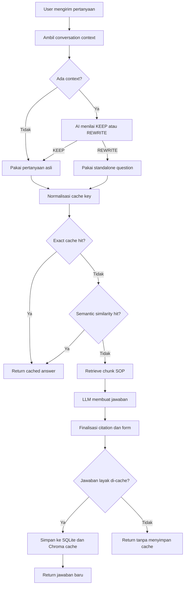
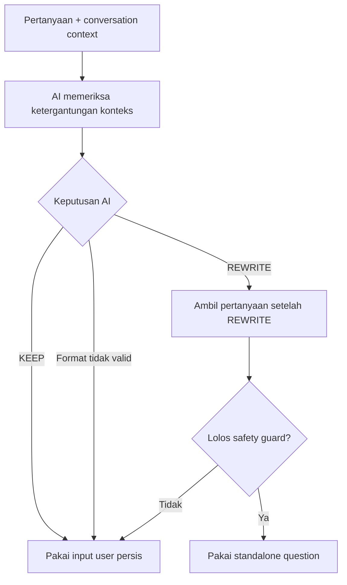
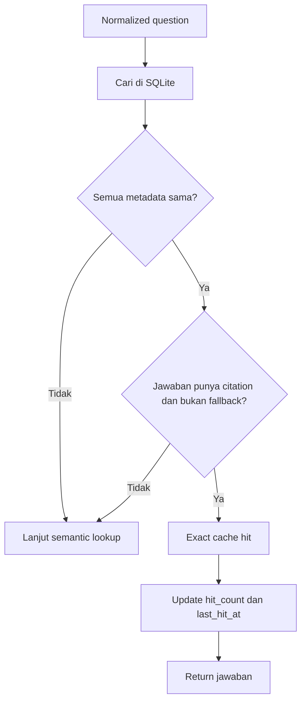
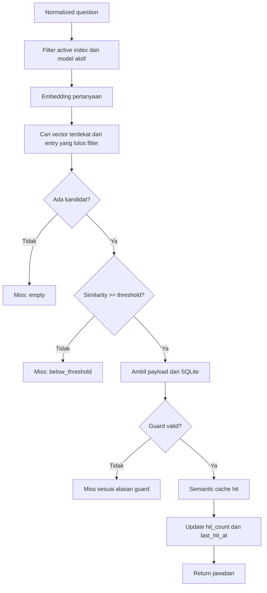
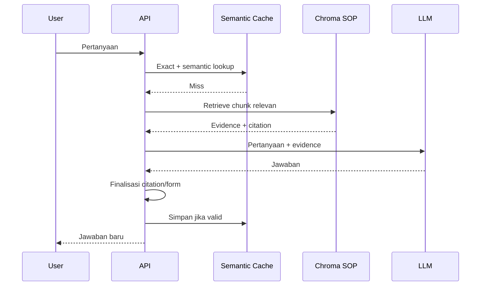
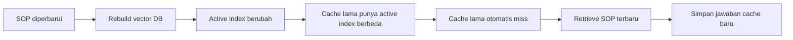

# Alur Semantic Cache

Dokumen ini menjelaskan semantic cache dari dasar: masalah yang diselesaikan, alur keputusan, data yang disimpan, dan alasan sebuah request bisa `hit` atau `miss`.

## Inti Sederhana

Anggap semantic cache sebagai jalan pintas untuk pertanyaan yang pernah dijawab.

```text
Tanpa cache:
Pertanyaan -> cari SOP -> LLM membuat jawaban -> respons

Dengan cache:
Pertanyaan setara -> ambil jawaban lama yang masih valid -> respons
```

Contoh pertanyaan setara:

```text
HRIS tuh apa sih?
HRIS tuh apa sih???

Seberapa besar uang saku perjalanan dinas?
Nominal uang saku perjalanan dinas berapa?
```

Semantic cache tidak menggantikan RAG. Ia hanya melewati retrieval dan generation ketika jawaban lama aman dipakai kembali.

## Gambaran Besar



Ada dua jenis lookup:

1. **Exact normalized lookup** untuk pertanyaan yang sama setelah kapitalisasi dan tanda baca diabaikan.
2. **Semantic lookup** untuk kalimat berbeda yang memiliki arti serupa.

Exact lookup selalu dicoba lebih dulu karena lebih cepat dan lebih aman.

## Tahap 1: Query Rewrite

Conversation context dibutuhkan untuk memahami pertanyaan lanjutan.

Contoh rujukan eksplisit:

```text
Sebelumnya: membahas perjalanan dinas
Pertanyaan: Form apa yang dipakai untuk itu?
```

Contoh rujukan implisit:

```text
Sebelumnya: membahas perjalanan dinas dalam negeri
Pertanyaan: Kalau luar negeri gimana?
```

Jika conversation context tersedia, AI wajib memilih salah satu output:

```text
KEEP
```

atau:

```text
REWRITE: <pertanyaan mandiri>
```

Alurnya:



Kenapa formatnya dibuat tegas?

- `KEEP` mencegah AI memoles bahasa user.
- `HRIS tuh apa sih?` tidak boleh berubah menjadi `HRIS itu apa sih?`.
- Output bebas tanpa prefix `REWRITE:` ditolak.
- Rewrite yang menambah angka baru atau terlalu panjang juga ditolak.

Jika tidak ada conversation context, AI rewrite tidak dipanggil dan pertanyaan asli langsung dipakai.

## Tahap 2: Normalisasi Cache Key

Sebelum lookup, pertanyaan dinormalisasi:

- Diubah menjadi lowercase.
- Tanda baca dibuang.
- Spasi berulang dirapikan.

Contoh:

```text
Input A: HRIS tuh apa sih?
Input B: hris TUH apa sih!!!

Normalized key:
hris tuh apa sih
```

Normalisasi ini hanya dipakai untuk pencarian cache. Pertanyaan asli tetap disimpan untuk audit.

## Tahap 3: Exact Lookup

Exact lookup dilakukan di SQLite menggunakan:

```text
normalized_question
+ active_index
+ MODEL
+ EMBED_MODEL
```



Exact hit tidak memanggil embedding model maupun Chroma.

Contoh log:

```text
semantic_cache=hit match=exact entry=... active_index=...
```

## Tahap 4: Semantic Lookup

Jika exact lookup gagal, sistem mencari pertanyaan paling mirip di Chroma semantic cache.



Filter metadata dijalankan sebelum ranking. Entry dari index atau model lama
tidak dapat lagi mengambil posisi kandidat teratas dan menutupi entry aktif.
Guard setelah retrieval tetap dipertahankan sebagai pemeriksaan cadangan.

Default threshold:

```env
SEMANTIC_CACHE_THRESHOLD=0.92
```

Threshold tinggi dipakai agar pertanyaan yang hanya terlihat mirip tidak mendapat jawaban yang salah.

Contoh yang tidak boleh salah hit:

```text
Berapa uang makan perjalanan dinas?
Berapa reimbursement transport perjalanan dinas?
```

Keduanya membahas biaya perjalanan, tetapi meminta komponen yang berbeda.

## Guard Cache

Vector yang mirip belum cukup untuk menghasilkan cache hit. Entry harus lolos seluruh guard berikut:

| Guard | Alasan |
| --- | --- |
| `active_index` sama | Jawaban harus berasal dari versi SOP yang sedang aktif |
| `MODEL` sama | Jawaban dari model berbeda tidak dipakai diam-diam |
| `EMBED_MODEL` sama | Skor embedding harus berasal dari ruang vector yang sama |
| Citation tidak kosong | Cache tidak boleh mengembalikan jawaban tanpa sumber |
| Jawaban bukan fallback | Jawaban "tidak ditemukan" tidak disimpan permanen |
| Similarity melewati threshold | Pertanyaan berbeda maksud tidak boleh dianggap sama |

Exact lookup juga memakai guard yang sama, kecuali similarity karena key-nya sudah sama persis setelah normalisasi.

## Cache Miss dan Penyimpanan

Jika exact dan semantic lookup sama-sama gagal, sistem menjalankan RAG normal.



Jawaban disimpan hanya jika:

- Jawaban tidak kosong.
- Citation tersedia.
- Jawaban bukan unsupported/fallback.

Yang disimpan:

```text
SQLite:
- pertanyaan asli
- normalized question
- jawaban
- citations
- selected forms
- active index
- model name
- embedding model name
- waktu dan hit counter

Chroma semantic cache:
- embedding normalized question
- entry_id untuk menunjuk payload SQLite
```

## Storage

```text
backend/cache/app_state.db
├── conversation_messages
└── semantic_cache_entries

backend/cache/semantic_chroma
└── vector pertanyaan semantic cache

backend/chroma_db
└── vector chunk SOP untuk retrieval utama
```

Pembagian tanggung jawab:

- **SQLite** menyimpan data presisi dan metadata validasi.
- **Semantic Chroma** mencari pertanyaan yang artinya mirip.
- **Chroma SOP** mencari evidence dari dokumen perusahaan.

## Saat SOP Berubah

Reindex membuat nama active index baru.



Cache lama tidak harus langsung dihapus. Entry tersebut tidak dipakai karena metadata `active_index` berbeda.

## Conversation Store vs Semantic Cache

Keduanya berada di SQLite, tetapi tujuannya berbeda:

| Fitur | Fungsi |
| --- | --- |
| Conversation store | Memberi konteks untuk memahami follow-up |
| Semantic cache | Menghindari retrieval dan generation berulang |

Alur conversation:

```text
conversation_id
-> ambil message terbaru
-> bentuk conversation context
-> AI memilih KEEP atau REWRITE
```

Setelah respons selesai, pertanyaan dan jawaban baru ditambahkan ke tabel `conversation_messages`.

## Membaca Log

### Exact hit

```text
semantic_cache=hit match=exact entry=... active_index=...
```

Makna: normalized question dan seluruh metadata sama. Embedding tidak dipanggil.

### Semantic hit

```text
semantic_cache=hit similarity=0.96 entry=... active_index=...
```

Makna: wording berbeda, tetapi similarity melewati threshold dan seluruh guard valid.

### Di bawah threshold

```text
semantic_cache=miss reason=below_threshold similarity=0.71 entry=...
```

Makna: Chroma menemukan kandidat, tetapi kemiripannya belum cukup aman.

### Index berbeda

```text
semantic_cache=miss reason=index_mismatch cached_index=... active_index=...
```

Makna: SOP telah direindex sehingga jawaban lama tidak boleh digunakan.
Log ini sekarang seharusnya jarang muncul karena entry index lama sudah disaring
sebelum vector search.

### Model berbeda

```text
semantic_cache=miss reason=model_mismatch
```

Makna: model generasi atau embedding berubah.

### Payload tidak aman

```text
semantic_cache=miss reason=uncacheable_payload
```

Makna: payload kosong, citation hilang, atau jawaban merupakan fallback.

### Entry baru disimpan

```text
semantic_cache=stored entry=... active_index=...
```

## Contoh Kasus HRIS

Sebelum perbaikan:

```text
Cache lama: HRIS tuh apa sih
Pertanyaan baru: HRIS tuh apa sih?
AI rewrite: HRIS itu apa sih?
Similarity: 0.7192
Hasil: miss
```

Setelah perbaikan:

```text
AI decision: KEEP
Pertanyaan yang dipakai: HRIS tuh apa sih?
Normalized key: hris tuh apa sih
Exact SQLite lookup: hit
Similarity search: tidak dijalankan
```

## Konfigurasi

```env
APP_STATE_DB=backend/cache/app_state.db
SEMANTIC_CACHE_ENABLED=true
SEMANTIC_CACHE_DIR=backend/cache/semantic_chroma
SEMANTIC_CACHE_THRESHOLD=0.92
SEMANTIC_CACHE_TOP_K=1
```

Mematikan semantic cache:

```env
SEMANTIC_CACHE_ENABLED=false
```

Conversation context dan RAG tetap bekerja ketika semantic cache dimatikan.

## Testing

Test terkait:

```powershell
python -m unittest tests.test_cache_db tests.test_semantic_cache tests.test_answer_finalization -v
```

Skenario manual:

```text
1. Tanya: HRIS tuh apa sih
2. Pastikan jawaban memiliki citation dan log menunjukkan stored.
3. Tanya: HRIS tuh apa sih?
4. Pastikan log menunjukkan hit match=exact.
5. Tanya paraphrase dengan arti sama.
6. Pastikan semantic hit jika similarity melewati threshold.
7. Tanya topik mirip tetapi berbeda maksud.
8. Pastikan tidak terjadi cache hit yang salah.
9. Reindex SOP.
10. Pastikan entry cache dari index lama tidak digunakan.
```

## Ringkasan Satu Kalimat

Semantic cache mencoba **exact normalized match terlebih dahulu**, lalu **semantic similarity**, dan hanya mengembalikan jawaban lama jika **index, model, citation, serta isi jawaban masih valid**.
