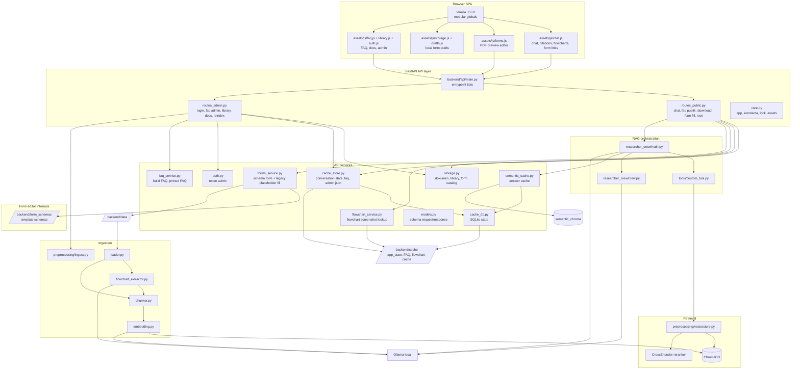

# ICS SOP & Knowledge Assistant - Architecture

Arsitektur backend saat ini sudah memakai API layer yang dipecah menjadi beberapa
modul kecil. `backend/api/main.py` sekarang hanya entrypoint tipis yang mengekspor
`app` dan mengimpor route agar endpoint terdaftar.

## Topology

## Komponen

| Layer | File | Tanggung jawab |
|---|---|---|
| Config | `backend/settings.py` | Load `.env` dan helper env |
| API core | `backend/api/core.py` | Objek `app`, konstanta, lock, mount assets |
| API models | `backend/api/models.py` | Semua schema Pydantic |
| Public routes | `backend/api/routes_public.py` | Chat, FAQ publik, download dokumen, form fill, root UI |
| Admin routes | `backend/api/routes_admin.py` | Login admin, FAQ admin, library, upload/delete docs, reindex |
| Storage helpers | `backend/api/storage.py` | Dokumen, library, form catalog, path validation |
| Cache helpers | `backend/api/cache_store.py` | Context percakapan via `backend/cache_db.py`, plus `faqs.json` dan `admin.json` |
| State DB | `backend/cache_db.py` | SQLite untuk conversation dan semantic cache metadata |
| Semantic cache | `backend/semantic_cache.py` | Exact/vector answer cache dan reset saat reindex |
| Auth helpers | `backend/api/auth.py` | Token admin, signing, verification |
| FAQ helpers | `backend/api/faq_service.py` | Build FAQ dari RAG dan pinned organogram FAQ |
| Form helpers | `backend/api/forms_service.py` | Legacy placeholder scan/fill, schema loader, dan render PDF schema-driven |
| Form schemas | `backend/form_schemas/*.json` | Mapping field per template PDF untuk editor v1 |
| Flowchart helpers | `backend/api/flowchart_service.py` | Cari payload flowchart untuk citation dan serve screenshot |
| Chat orchestration | `backend/researcher_crew/main.py` | Rewrite query, panggil retrieval, panggil CrewAI/Ollama |
| Crew definition | `backend/researcher_crew/crew.py` | Agent, task, dan CrewAI object |
| Retrieval tool | `backend/researcher_crew/tools/custom_tool.py` | Evidence text dan citation dari hasil search |
| Ingestion | `backend/preprocessing/` | Loader, flowchart extraction, cleaner, chunker, embedding, vector store |
| Startup check | `backend/scripts/storage_status.py` | Cek source docs dan vector DB |
| Frontend bootstrap | `frontend/web/assets/app.js` | Inisialisasi state, elemen DOM, navigasi, dan pemanggilan modul UI |
| Frontend API helpers | `frontend/web/assets/js/api.js` | Helper fetch, auth header, error formatting, dan download response |
| Frontend storage | `frontend/web/assets/js/storage.js` | Session admin, state UI kecil, dan draft form lokal via `localStorage` |
| Frontend chat | `frontend/web/assets/js/chat.js` | Submit chat, render jawaban/citation/flowchart, dan render link form dari jawaban |
| Frontend form editor | `frontend/web/assets/js/forms.js` | Modal editor PDF preview, schema/legacy form flow, live overlay, submit fill, dan auto-save draft |
| Frontend form drafts | `frontend/web/assets/js/drafts.js` | Floating launcher draft form di layar chat |
| Frontend FAQ | `frontend/web/assets/js/faq.js` | Load/render FAQ publik dan CRUD FAQ admin |
| Frontend library | `frontend/web/assets/js/library.js` | List dokumen, upload/update/delete dokumen, dan rebuild embeddings |
| Frontend auth | `frontend/web/assets/js/auth.js` | Login/logout admin dan binding modal admin/form |
| Frontend markdown | `frontend/web/assets/js/markdown.js` | Render markdown jawaban chat |

## Jalur utama

**Chat**

`frontend/web/assets/js/chat.js` -> `POST /query` -> `routes_public.py` ->
`cache_store.py` (context) -> `researcher_crew/main.py` -> semantic cache.
Jika cache miss, lanjut ke `custom_tool.py` -> `vectorstore.py` -> CrewAI/Ollama.
Setelah jawaban final, backend menyimpan semantic cache bila valid dan kembali ke
`routes_public.py` untuk bentuk `answer + citations + form_downloads + flowcharts`.
`chat.js` lalu merender jawaban, citation, screenshot flowchart, dan tombol form.

**FAQ admin**

`frontend/web/assets/js/faq.js` -> `POST /api/admin/faq` -> `routes_admin.py`
-> `faq_service.py` -> `run_faq_crew()` -> retrieval -> Ollama -> validasi
evidence -> simpan ke `backend/cache/faqs.json`.

**Upload dokumen dan reindex**

`frontend/web/assets/js/library.js` -> `POST /api/admin/documents` /
`DELETE /api/admin/documents/...` -> `routes_admin.py` -> `storage.py`.
Jika file embeddable berubah, frontend akan meminta reindex ->
`POST /api/admin/reindex` -> `preprocessing/ingest.py`.
Reindex memuat dokumen terbaru, mengekstrak flowchart PDF jika enabled, rebuild
vector DB, lalu memanggil `reset_semantic_cache()` agar jawaban lama tidak dipakai.

**Flowchart**

Saat ingest PDF, `flowchart_extractor.py` mencari heading `ALUR PROSES`, membaca
image diagram dengan Ollama vision, menyimpan payload ke `backend/cache/flowcharts`,
dan memasukkan representasi teks flowchart ke vector DB. Saat chat mengembalikan
citation flowchart, `flowchart_service.py` bisa mengirim screenshot jika
`FLOWCHART_DISPLAY_ENABLED=true`.

**Form fill**

Untuk template yang sudah dimigrasikan, frontend membuka editor PDF preview:
`frontend/web/assets/js/forms.js` -> `GET /api/forms/schema` -> `forms_service.py`
load schema dari `backend/form_schemas/*.json` -> browser render preview PDF +
panel field -> `POST /api/forms/fill` dengan `multipart/form-data` ->
`forms_service.py` render text / textarea / checkbox / signature image ke PDF di
memory -> file hasil dikirim langsung ke browser. Draft input disimpan lokal oleh
`frontend/web/assets/js/storage.js`, dan launcher draft di chat dirender oleh
`frontend/web/assets/js/drafts.js`.

Untuk template yang belum punya schema, flow lama tetap tersedia:
`GET /api/forms/fields` -> scan placeholder atas -> `POST /api/forms/fill` ->
isi placeholder sederhana lalu kirim PDF hasil.
