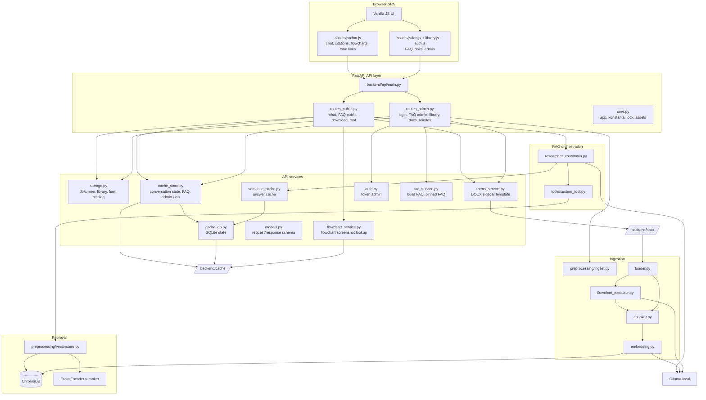

# ICS SOP & Knowledge Assistant - Architecture

Backend memakai API layer kecil: `backend/api/main.py` hanya mengekspor `app`
dan mengimpor route agar endpoint terdaftar.

## Topology

## Komponen

| Layer | File | Tanggung jawab |
|---|---|---|
| Config | `backend/settings.py` | Load `.env` dan helper env |
| API core | `backend/api/core.py` | Objek `app`, konstanta, lock, mount assets |
| API models | `backend/api/models.py` | Schema Pydantic untuk chat, FAQ, library, admin, dan download form |
| Public routes | `backend/api/routes_public.py` | Chat, FAQ publik, download dokumen/template, flowchart, root UI |
| Admin routes | `backend/api/routes_admin.py` | Login admin, FAQ admin, library, upload/delete docs, reindex |
| Storage helpers | `backend/api/storage.py` | Dokumen, library, form catalog, path validation |
| Form helpers | `backend/api/forms_service.py` | Generate, ambil, dan hapus DOCX sidecar untuk PDF form |
| Cache helpers | `backend/api/cache_store.py` | Context percakapan, `faqs.json`, dan `admin.json` |
| Semantic cache | `backend/semantic_cache.py` | Exact/vector answer cache dan reset saat reindex |
| Flowchart helpers | `backend/api/flowchart_service.py` | Cari payload flowchart untuk citation dan serve screenshot |
| Frontend chat | `frontend/web/assets/js/chat.js` | Submit chat, render jawaban/citation/flowchart, dan render tombol form |
| Frontend library | `frontend/web/assets/js/library.js` | List dokumen, upload/update/delete, modal PDF/Word, dan rebuild embeddings |

## Jalur Utama

**Chat**

`chat.js` -> `POST /query` -> `routes_public.py` -> context/cache ->
`researcher_crew/main.py` -> retrieval/generation bila cache miss -> response
`answer + citations + form_downloads + flowcharts`.

**Template form**

`chat.js` atau `library.js` membuka modal pilihan format. PDF memakai
`GET /api/documents/{form.pdf}`. Word memakai
`GET /api/documents/{form.pdf}?format=docx`, lalu `forms_service.py` memastikan
file `.docx` pasangan tersedia di `backend/data`.

**Upload dokumen dan reindex**

`library.js` -> `POST /api/admin/documents` atau `DELETE /api/admin/documents/...`.
Untuk PDF form, backend membuat/menghapus DOCX sidecar dan tidak meminta reindex.
Untuk dokumen embeddable non-form, frontend meminta admin menjalankan
`POST /api/admin/reindex`.

**Flowchart**

Saat ingest PDF, `flowchart_extractor.py` mencari diagram, memanggil Ollama
vision, menyimpan payload ke cache, dan memasukkan representasi teks ke vector DB.
