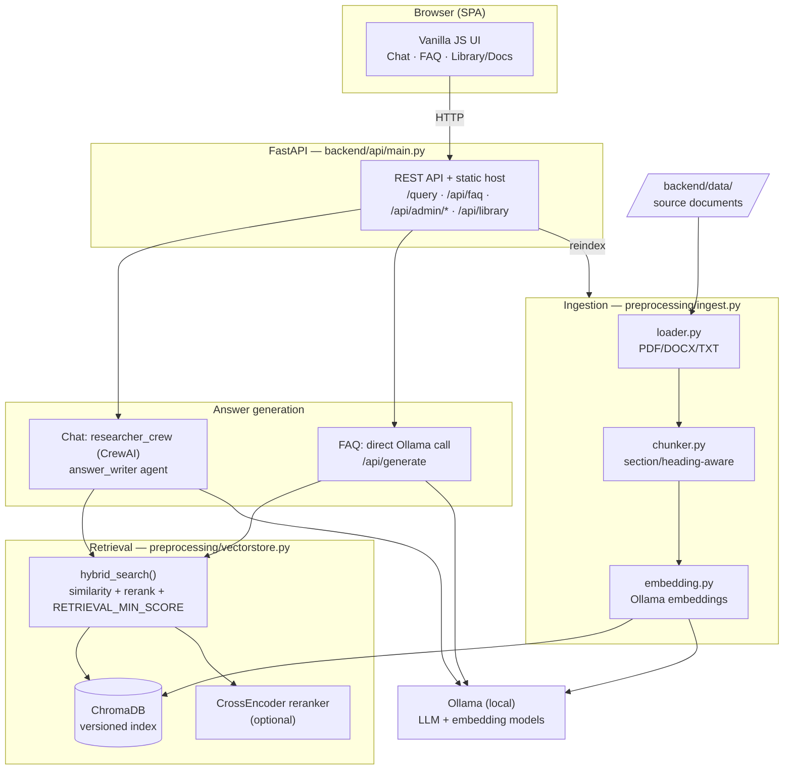

# ICS SOP & Knowledge Assistant — Architecture

A local, privacy-first RAG assistant for internal SOPs and HR documents. Everything
runs on-premise: FastAPI serves both the API and the web UI, ChromaDB stores the
vector index, and Ollama provides the LLM and embeddings. No cloud LLM is used.

## Topology

> If Mermaid does not render, view this file on GitHub or a Mermaid-enabled
> Markdown viewer (e.g. VS Code with the Markdown Preview Mermaid extension).

## Components

| Layer | File | Responsibility |
|---|---|---|
| Config | `backend/settings.py` | Load `.env` once; `get_env` / `get_int_env` / `get_float_env` helpers |
| API / host | `backend/api/main.py` | All REST endpoints + serves the web UI |
| Chat crew | `backend/researcher_crew/` | CrewAI `answer_writer` agent for conversational answers |
| FAQ generation | `researcher_crew/main.py` (`_generate_faq_answer`) | Direct Ollama `/api/generate` call for short FAQ answers |
| Retrieval | `preprocessing/vectorstore.py` | `hybrid_search`: similarity → rerank → relevance threshold |
| Ingestion | `preprocessing/{loader,chunker,embedding,ingest}.py` | Docs → chunks → embeddings → versioned Chroma index |
| Startup check | `scripts/storage_status.py` | Validates the vector DB before serving (used by `run.bat`) |
| Frontend | `frontend/web/` | Single-page UI (HTML/CSS/vanilla JS) |

## Key flows

**Chat (`POST /query`)**
`app.js` → `run_knowledge_crew` → `retrieve_knowledge` (`hybrid_search`) → CrewAI
`answer_writer` → citations post-processed → answer + citation chips.

**FAQ (`POST /api/admin/faq`)**
`app.js` → `run_faq_crew` → `retrieve_knowledge`. If no relevant source clears
`RETRIEVAL_MIN_SCORE`, it returns immediately (no LLM call) → "no source". Otherwise
a direct Ollama call generates a short, citation-tagged answer (thinking disabled so
the token budget goes to the answer, not hidden reasoning).

**Ingestion (`python -m backend.preprocessing.ingest`, or admin "Rebuild embeddings")**
`data/*` → `loader` → `chunker` (cleans SOP noise, splits by `Pasal`/`BAB`/heading)
→ `embedding` → `rebuild_vectorstore` writes a new UUID-versioned Chroma index and
flips the `.active-chroma-index` marker (non-destructive swap).

## Relevance short-circuit

`hybrid_search` reranks candidates and normalizes each score to 0–1 (sigmoid). If the
best score is below `RETRIEVAL_MIN_SCORE`, it returns nothing, so off-topic questions
get an instant "no source" response without invoking the LLM. Set the threshold to `0`
to disable.

## Configuration (`.env`)

| Variable | Purpose |
|---|---|
| `MODEL` | Ollama chat/generation model (e.g. `ollama/qwen3:8b`) |
| `EMBED_MODEL` | Ollama embedding model |
| `RERANK_MODEL` | CrossEncoder reranker (optional) |
| `OLLAMA_BASE_URL` | Ollama endpoint (default `http://localhost:11434`) |
| `OLLAMA_NUM_CTX` / `OLLAMA_NUM_PREDICT` | Context window / max answer tokens (chat) |
| `FAQ_NUM_PREDICT` | Max answer tokens for FAQ answers |
| `OLLAMA_TIMEOUT_SECONDS` | Per-request timeout |
| `RETRIEVAL_MIN_SCORE` | Min rerank relevance (0–1) to count as a real source |
| `TOP_K` | Chunks retrieved per query |
| `CHROMA_DIR` / `DATA_DIR` | Vector index / source document directories |

## Stack

FastAPI · Uvicorn · CrewAI (chat) · LangChain (loaders/splitter/chroma/ollama) ·
ChromaDB · Ollama (LLM + embeddings) · sentence-transformers (rerank) ·
pypdf / docx2txt · vanilla HTML/CSS/JS.
