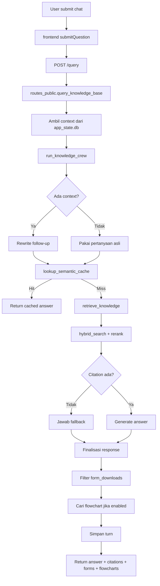
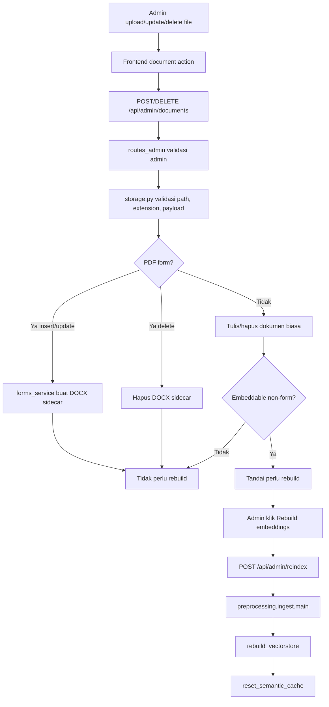
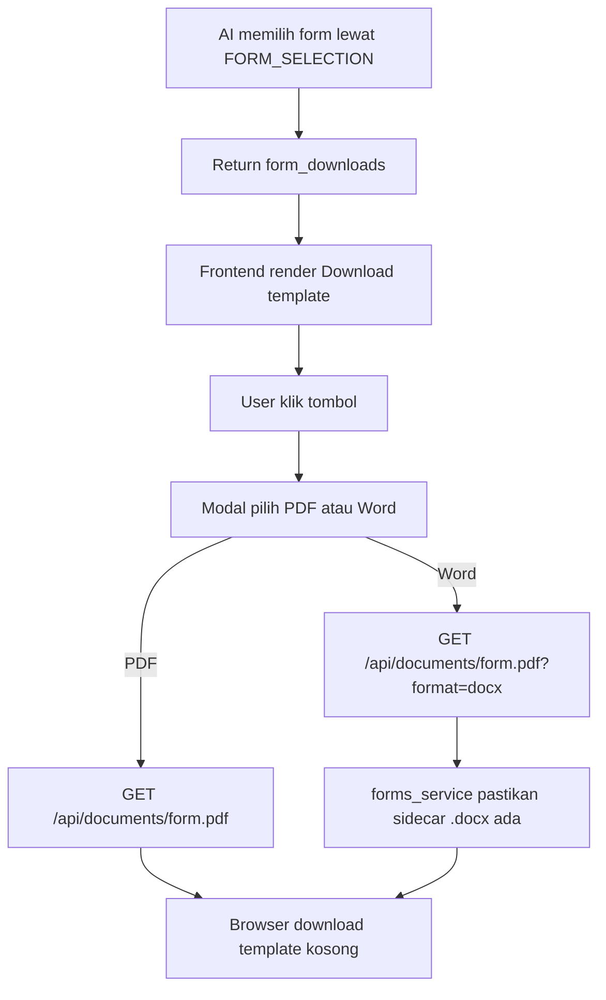
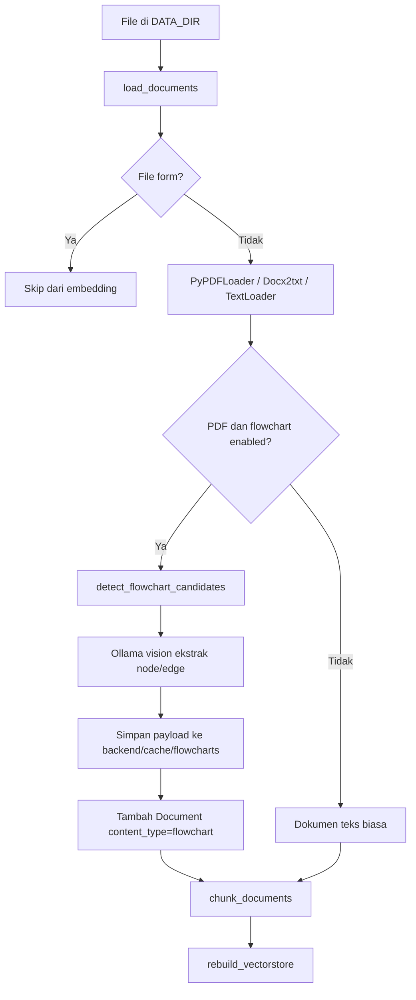
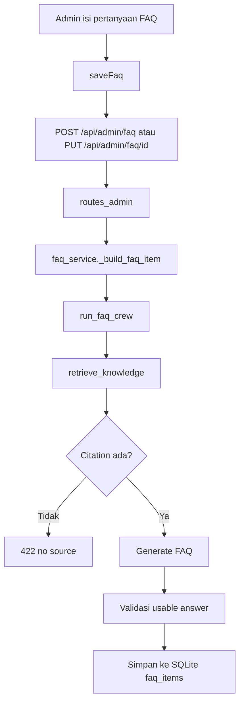

# System Flows Capstone

Peta cepat flow sistem setelah formfill dihapus. Form sekarang hanya template
kosong yang bisa diunduh sebagai PDF atau DOCX.

## 1. Chat RAG dan Context Switching

## 2. Admin Document dan Rebuild Embedding

## 3. Download Template Form

| Step | Fungsi | Lokasi |
|---|---|---|
| Katalog form untuk AI | `_available_form_catalog()` | `backend/api/storage.py` |
| Map form pilihan AI | `_selected_form_downloads()` | `backend/api/storage.py` |
| Render block form | `renderFormDownloads()` | `frontend/web/assets/js/chat.js` |
| Modal format | `openTemplateDownloadModal()` | `frontend/web/assets/js/library.js` |
| Download document | `download_document()` | `backend/api/routes_public.py` |
| Ambil DOCX sidecar | `get_form_docx_template()` | `backend/api/forms_service.py` |

## 4. Chunking dan Flowchart Extraction

## 5. FAQ

## Index Lokasi Cepat

| Kebutuhan cek | Mulai dari |
|---|---|
| Jawaban chat berubah topik | `backend/researcher_crew/src/researcher_crew/main.py` |
| Retrieval tidak menemukan sumber | `backend/preprocessing/vectorstore.py` |
| Semantic cache hit/miss | `backend/semantic_cache.py` |
| Cache lama hilang setelah reindex | `backend/preprocessing/ingest.py` dan `backend/semantic_cache.py` |
| Form muncul/tidak muncul | `backend/api/storage.py` |
| Download PDF/DOCX form gagal | `backend/api/forms_service.py` dan `backend/api/routes_public.py` |
| Admin harus rebuild | `backend/api/routes_admin.py` dan `backend/preprocessing/ingest.py` |
| FAQ gagal dibuat | `backend/api/faq_service.py` |
