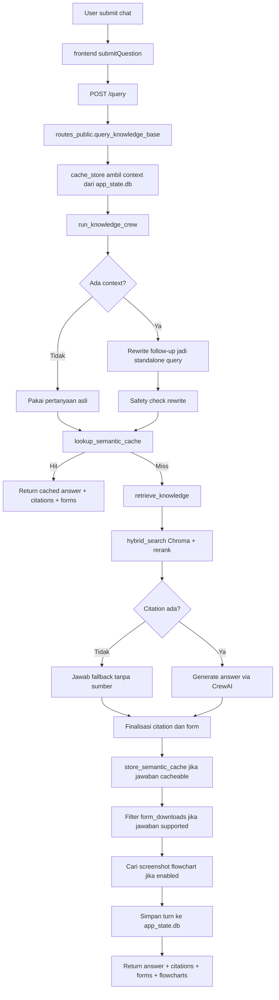
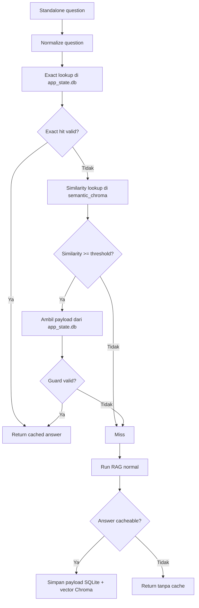
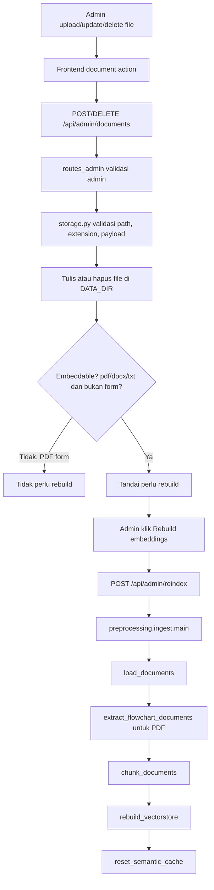
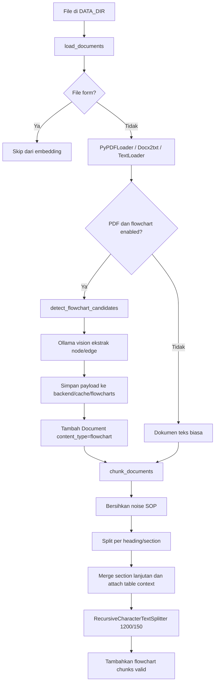
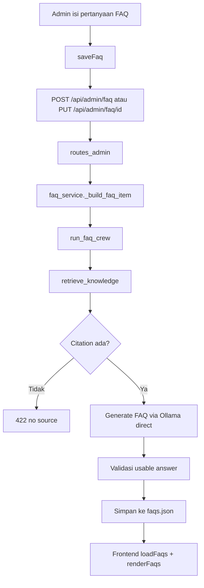
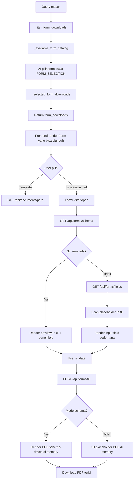

# System Flows Capstone

Dokumen ini adalah peta cepat flow sistem yang sudah disesuaikan dengan struktur
backend terbaru. Referensi dibuat di level file/fungsi, bukan line number, supaya
tidak cepat basi saat ada refactor kecil.

## 1. Chat RAG dan Context Switching

### Diagram



### Fungsi dan lokasi

| Step | Fungsi | Lokasi |
|---|---|---|
| Submit chat dari frontend | `submitQuestion()` | `frontend/web/assets/js/chat.js` |
| Endpoint chat | `query_knowledge_base()` | `backend/api/routes_public.py` |
| Ambil context | `_get_conversation_context()` | `backend/api/cache_store.py` |
| Simpan turn | `_append_conversation_turn()` | `backend/api/cache_store.py` |
| Rewrite follow-up | `_rewrite_query()` | `backend/researcher_crew/src/researcher_crew/main.py` |
| Safety rewrite | `_rewrite_is_safe()` | `backend/researcher_crew/src/researcher_crew/main.py` |
| Orkestrasi RAG chat | `run_knowledge_crew()` | `backend/researcher_crew/src/researcher_crew/main.py` |
| Lookup semantic cache | `lookup_semantic_cache()` | `backend/semantic_cache.py` |
| Simpan semantic cache | `store_semantic_cache()` | `backend/semantic_cache.py` |
| Retrieval evidence | `retrieve_knowledge()` | `backend/researcher_crew/src/researcher_crew/tools/custom_tool.py` |
| Vector search/rerank | `hybrid_search()` | `backend/preprocessing/vectorstore.py` |
| Generate jawaban | `_generate_answer()` | `backend/researcher_crew/src/researcher_crew/main.py` |
| CrewAI object | `ResearcherCrew.crew()` | `backend/researcher_crew/src/researcher_crew/crew.py` |
| Filter form untuk unsupported answer | `_answer_has_supported_form_context()` | `backend/api/storage.py` |
| Katalog form untuk AI | `_available_form_catalog()` | `backend/api/storage.py` |
| Map form pilihan AI | `_selected_form_downloads()` | `backend/api/storage.py` |
| Cari flowchart untuk citation | `find_flowcharts_for_citations()` | `backend/api/flowchart_service.py` |

### Cara context switching bekerja

| Kondisi pertanyaan | Yang dilakukan sistem |
|---|---|
| Tidak ada context lama | Pertanyaan langsung dipakai untuk retrieval dan generation. |
| Ada context, tapi pertanyaan tidak merujuk ke sebelumnya | `_rewrite_query()` diarahkan untuk menyalin pertanyaan apa adanya. |
| Ada context dan pertanyaan merujuk ke sebelumnya | `_rewrite_query()` mengganti kata rujukan seperti `itu`, `tersebut`, `tadi`, `sebelumnya`, `barusan`, atau akhiran `-nya`. |
| Rewrite menambah angka/detail baru | `_rewrite_is_safe()` menolak rewrite dan balik ke pertanyaan asli. |

### Detail penting

| Item | Detail |
|---|---|
| File state conversation | `backend/cache/app_state.db` |
| File semantic vector cache | `backend/cache/semantic_chroma` |
| Batas context | Konstanta di `backend/api/core.py` |
| TTL conversation | `CONVERSATION_TTL` di `backend/api/core.py` |
| Model rewrite | Ollama direct lewat `_ollama_generate()` |
| Model answer | CrewAI single-agent `answer_writer` |
| Unsupported answer | Backend tidak menampilkan form download jika jawaban terdeteksi unsupported |
| Semantic cache | Exact lookup dulu, lalu similarity lookup dengan threshold `SEMANTIC_CACHE_THRESHOLD` |

## 2. Semantic Cache

### Diagram



### Guard utama

| Guard | Tujuan |
|---|---|
| `active_index` sama | Jawaban harus dari vector index SOP yang aktif |
| `MODEL` sama | Hindari reuse jawaban dari model generasi berbeda |
| `EMBED_MODEL` sama | Hindari skor similarity dari embedding space berbeda |
| Citation ada | Cache tidak mengembalikan jawaban tanpa sumber |
| Jawaban bukan fallback | Unsupported answer tidak disimpan |
| Similarity cukup | Default threshold ada di `SEMANTIC_CACHE_THRESHOLD` |

### Reset cache

Semantic cache dihapus setelah reindex selesai:

```text
reindex_documents()
-> preprocessing.ingest.main()
-> rebuild_vectorstore()
-> reset_semantic_cache()
-> hapus semantic_cache_entries + delete_collection semantic_chroma
```

Kode terkait:

| Fungsi | Lokasi |
|---|---|
| Reset semantic cache | `reset_semantic_cache()` di `backend/semantic_cache.py` |
| Hapus metadata cache | `clear_semantic_cache()` di `backend/cache_db.py` |
| Trigger setelah rebuild | `main()` di `backend/preprocessing/ingest.py` |

## 3. Admin Document dan Rebuild Embedding

### Diagram



### Fungsi dan lokasi

| Step | Fungsi | Lokasi |
|---|---|---|
| Upload banyak file | `saveDocuments()` | `frontend/web/assets/js/library.js` |
| Upload/update satu file | `saveDocument()` | `frontend/web/assets/js/library.js` |
| Delete dokumen UI | `deleteDocument()` | `frontend/web/assets/js/library.js` |
| Rebuild embeddings UI | `rebuildEmbeddings()` | `frontend/web/assets/js/library.js` |
| Insert/update backend | `save_document()` | `backend/api/routes_admin.py` |
| Delete backend | `delete_document()` | `backend/api/routes_admin.py` |
| Rebuild backend | `reindex_documents()` | `backend/api/routes_admin.py` |
| Load source docs | `load_documents()` | `backend/preprocessing/loader.py` |
| Ekstrak flowchart PDF | `extract_flowchart_documents()` | `backend/preprocessing/flowchart_extractor.py` |
| Chunk docs | `chunk_documents()` | `backend/preprocessing/chunker.py` |
| Build Chroma index | `rebuild_vectorstore()` | `backend/preprocessing/vectorstore.py` |
| Orkestrasi ingest | `main()` | `backend/preprocessing/ingest.py` |
| Reset semantic cache | `reset_semantic_cache()` | `backend/semantic_cache.py` |

### Detail rebuild embedding

| Step | Detail |
|---|---|
| Lock | `REINDEX_LOCK` di `backend/api/core.py` |
| Dokumen yang masuk vector DB | `.pdf`, `.docx`, `.txt` |
| Dokumen yang tidak masuk vector DB | PDF form dengan nama diawali `Form` |
| Active index | `rebuild_vectorstore()` membuat folder `indexes/<uuid>` lalu menulis `.active-chroma-index` |
| Marker citation schema | `backend/preprocessing/ingest.py` menulis `.citation-metadata-v1` |
| Semantic cache lama | Dihapus setelah vector DB selesai dibangun ulang |

## 4. Chunking dan Flowchart Extraction

### Diagram



### Titik penting chunker

| Bagian | Fokus |
|---|---|
| `_clean_page_text()` | Buang cover, header/footer, halaman pengesahan, boilerplate SOP |
| `_looks_like_heading()` | Deteksi heading seperti `1. TUJUAN`, `BAB`, `Pasal`, dan heading uppercase |
| `split_documents_by_section()` | Menjaga chunk tetap berada dalam konteks section SOP |
| `_merge_section_segments()` | Gabungkan section yang lanjut di halaman berikutnya |
| `_attach_table_context()` | Simpan konteks header tabel supaya row tidak kehilangan makna |
| `chunk_documents()` | Split final teks, filter flowchart low confidence/incomplete, lalu beri `chunk_id` |

### Flowchart display

Flowchart extraction bisa aktif untuk embedding, tetapi screenshot hanya dikirim ke chat jika `FLOWCHART_DISPLAY_ENABLED=true`.

| Fungsi | Lokasi |
|---|---|
| Cari payload flowchart untuk citation | `find_flowcharts_for_citations()` di `backend/api/flowchart_service.py` |
| Endpoint screenshot | `GET /api/flowcharts/{flowchart_id}` di `backend/api/routes_public.py` |
| Render frontend | `renderFlowchartScreenshots()` di `frontend/web/assets/js/chat.js` |

## 5. FAQ

### Diagram



### Fungsi dan lokasi

| Step | Fungsi | Lokasi |
|---|---|---|
| Render FAQ list | `renderFaqs()` | `frontend/web/assets/js/faq.js` |
| Load FAQ list | `loadFaqs()` | `frontend/web/assets/js/faq.js` |
| Save FAQ frontend | `saveFaq()` | `frontend/web/assets/js/faq.js` |
| GET FAQ | `get_faq()` | `backend/api/routes_public.py` |
| Build FAQ item | `_build_faq_item()` | `backend/api/faq_service.py` |
| Create FAQ | `create_faq()` | `backend/api/routes_admin.py` |
| Update FAQ | `update_faq()` | `backend/api/routes_admin.py` |
| Delete FAQ | `delete_faq()` | `backend/api/routes_admin.py` |
| Generate FAQ answer | `run_faq_crew()` | `backend/researcher_crew/src/researcher_crew/main.py` |
| FAQ prompt direct Ollama | `_generate_faq_answer()` | `backend/researcher_crew/src/researcher_crew/main.py` |

### Data FAQ

| Data | Lokasi |
|---|---|
| Stored FAQ | `backend/cache/faqs.json` |
| Pinned organogram FAQ | `_pinned_faq_items()` di `backend/api/faq_service.py` |
| Pinned image upload | `upload_pinned_faq_image()` di `backend/api/routes_admin.py` |

## 6. Auto-Fill Form PDF

### Diagram



### Fungsi dan lokasi

| Step | Fungsi | Lokasi |
|---|---|---|
| Kumpulkan form tersedia | `_iter_form_downloads()` | `backend/api/storage.py` |
| Kirim katalog form ke AI | `_available_form_catalog()` | `backend/api/storage.py` |
| Map form pilihan AI | `_selected_form_downloads()` | `backend/api/storage.py` |
| Render block form | `renderFormDownloads()` | `frontend/web/assets/js/chat.js` |
| Buka editor isi form | `FormEditor.open()` | `frontend/web/assets/js/forms.js` |
| Fetch schema form | `fetchSchema()` | `frontend/web/assets/js/forms.js` |
| Render field schema | `renderSchemaFormFields()` | `frontend/web/assets/js/forms.js` |
| Render preview schema | `renderSchemaPreview()` | `frontend/web/assets/js/forms.js` |
| Submit form fill | `FormEditor.submit()` | `frontend/web/assets/js/forms.js` |
| Endpoint schema form | `form_schema()` | `backend/api/routes_public.py` |
| Endpoint scan field | `form_fields()` | `backend/api/routes_public.py` |
| Endpoint fill form | `fill_form()` | `backend/api/routes_public.py` |
| Resolve form path | `_resolve_form_path()` | `backend/api/forms_service.py` |
| Cek schema template | `has_schema_form()` | `backend/api/forms_service.py` |
| Load schema form | `get_form_schema()` | `backend/api/forms_service.py` |
| Scan field PDF | `_scan_form_fields()` | `backend/api/forms_service.py` |
| Fill placeholder PDF | `_fill_form_placeholders()` | `backend/api/forms_service.py` |
| Render PDF schema | `fill_schema_form()` | `backend/api/forms_service.py` |

### Cara editor form bekerja

| Rule | Detail |
|---|---|
| Prioritas mode | Frontend mencoba schema editor dulu lewat `GET /api/forms/schema`; jika 404, baru fallback ke `GET /api/forms/fields` |
| Schema editor | Field didefinisikan manual per template di `backend/form_schemas/*.json` dengan `id`, `type`, `page`, `rect`, `section`, dan opsi render |
| Preview schema | Browser render PDF asli via `pdf.js`, lalu overlay field aktif dan nilai live di atas preview |
| Submit schema | `POST /api/forms/fill` kirim `multipart/form-data` berisi `payload` JSON + file signature image bila ada |
| Render schema | Backend menulis `text`, `textarea`, `date`, `checkbox`, dan `signature_image` langsung ke PDF di memory |
| Draft lokal | `frontend/web/assets/js/storage.js` menyimpan draft form ke `localStorage`, lalu `frontend/web/assets/js/drafts.js` menampilkan launcher draft di layar chat |
| Placeholder valid | Segmen teks PDF yang seluruh isinya bracket, contoh `[  ]` atau `[Tanggal]` |
| Label field | Diambil dari isi bracket, teks terdekat di kiri, atau teks tepat di atas lewat `_segment_label()` |
| Field legacy yang ditampilkan | Blok isian awal yang contiguous; bagian bawah seperti signature/free text dilewati |
| Deduplicate legacy | Label sama hanya muncul sekali di modal, tapi saat fill semua placeholder dengan label itu ikut terisi |
| Security | `_resolve_form_path()` memastikan path ada di `DATA_DIR`, file `.pdf`, dan `document_kind=form` |

## Index Lokasi Cepat

| Kebutuhan cek | Mulai dari |
|---|---|
| Kenapa jawaban chat berubah topik | `backend/researcher_crew/src/researcher_crew/main.py` |
| Kenapa retrieval tidak nemu sumber | `backend/preprocessing/vectorstore.py` |
| Kenapa semantic cache hit/miss | `backend/semantic_cache.py` |
| Kenapa cache lama hilang setelah reindex | `backend/preprocessing/ingest.py` dan `backend/semantic_cache.py` |
| Kenapa chunk aneh | `backend/preprocessing/chunker.py` |
| Kenapa flowchart muncul/tidak muncul | `backend/preprocessing/flowchart_extractor.py` dan `backend/api/flowchart_service.py` |
| Kenapa form muncul/tidak muncul | `backend/api/storage.py` |
| Kenapa admin harus rebuild | `backend/api/routes_admin.py` dan `backend/preprocessing/ingest.py` |
| Kenapa FAQ gagal dibuat | `backend/api/faq_service.py` |
| Kenapa field form tidak muncul | `backend/api/forms_service.py` |
| Kenapa form filled download gagal | `backend/api/forms_service.py` dan `backend/api/routes_public.py` |
