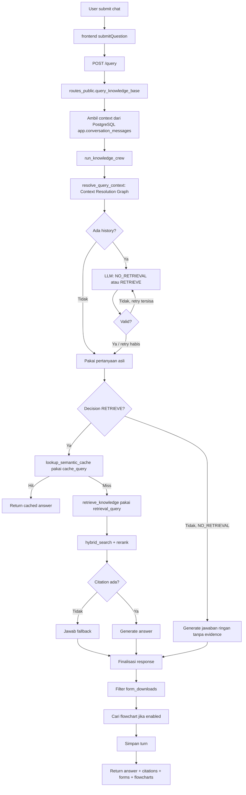
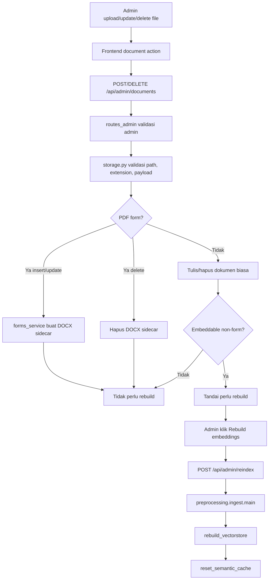
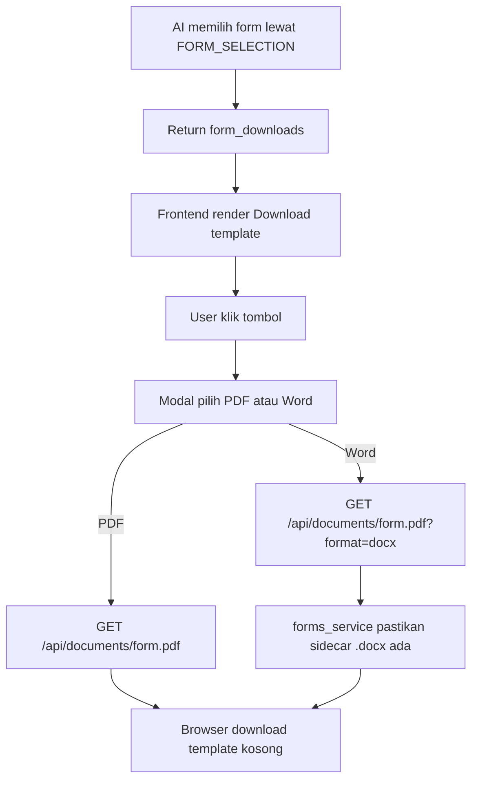
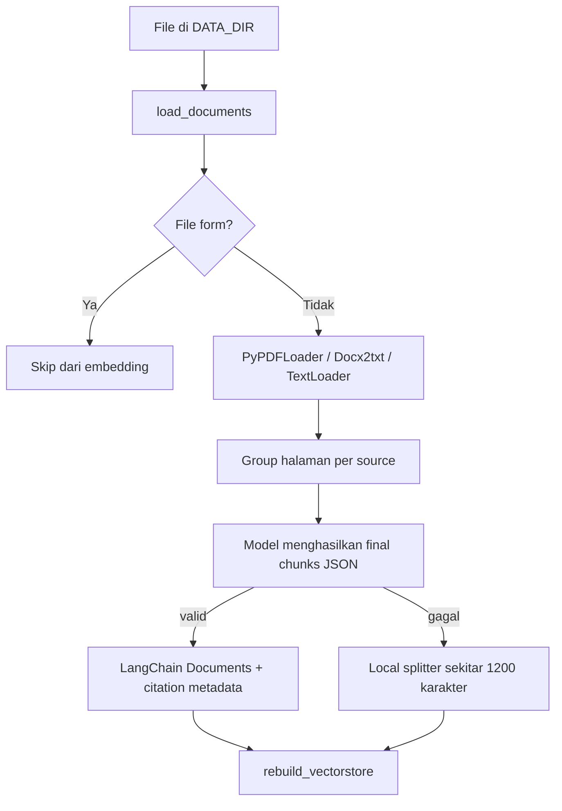
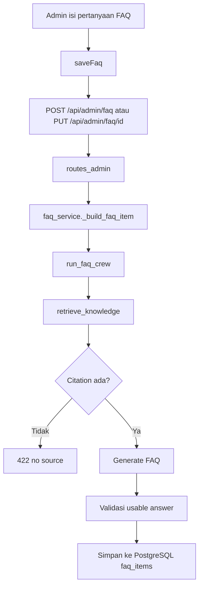

# System Flows Capstone

Peta teknis alur runtime HR Assistant saat ini. Form diperlakukan sebagai
template kosong yang dapat diunduh dalam format yang tersedia (PDF, Word, atau
Excel); aplikasi tidak mengisi isi form secara otomatis.

## 1. Chat RAG dan Context Switching

```mermaid
flowchart TD
  A[User submit chat] --> B[frontend submitQuestion]
  B --> C[POST /query]
  C --> D[routes_public.query_knowledge_base]
  D --> E[Ambil context dari PostgreSQL app.conversation_messages]
  E --> F[run_knowledge_crew]
  F --> G[resolve_query_context: Context Resolution Graph]
  G --> G1{Ada history?}
  G1 -->|Tidak| G4[Pakai pertanyaan asli]
  G1 -->|Ya| G2[LLM: NO_RETRIEVAL atau RETRIEVE]
  G2 --> G3{Valid?}
  G3 -->|Tidak, retry tersisa| G2
  G3 -->|Ya / retry habis| G4
  G4 --> H{Decision RETRIEVE?}
  H -->|Tidak, NO_RETRIEVAL| P2[Generate jawaban ringan tanpa evidence]
  H -->|Ya| J[lookup_semantic_cache pakai cache_query]
  J -->|Hit| K[Return cached answer]
  J -->|Miss| L[retrieve_knowledge pakai retrieval_query]
  L --> M[hybrid_search + rerank]
  M --> N{Citation ada?}
  N -->|Tidak| O[Jawab fallback]
  N -->|Ya| P[Generate answer]
  O --> Q[Finalisasi response]
  P --> Q
  P2 --> Q
  Q --> R[Filter form_downloads]
  R --> S[Cari flowchart jika enabled]
  S --> T[Simpan turn]
  T --> U[Return answer + citations + forms + flowcharts]
```

Context Resolution Graph (`backend/researcher_crew/src/researcher_crew/context_graph.py`)
mengganti modul rewrite regex+LLM lama. Semua keputusan (perlu retrieval atau
tidak, dan query apa yang dipakai) dibuat oleh satu LLM call per percobaan,
tanpa regex sama sekali — implemented sebagai LangGraph `StateGraph` dengan
node `check_history` -> `resolve_context` -> `validate` (retry loop heuristic,
bukan regex) -> `passthrough`. Node ini menghasilkan dua query: `retrieval_query`
(sintesis konteks yang lebih kaya, dipakai untuk pencarian dokumen) dan
`cache_query` (pertanyaan mandiri pendek, dipakai sebagai kunci semantic cache
dan disimpan sebagai `cache_question` untuk histori percakapan).

## 2. Admin Document dan Rebuild Embedding

```mermaid
flowchart TD
  A[Admin upload/update/delete file] --> B[Frontend document action]
  B --> C[POST/DELETE /api/admin/documents]
  C --> D[routes_admin validasi admin]
  D --> E[storage.py validasi path, extension, payload]
  E --> F{PDF form?}
  F -->|Ya insert/update| G[forms_service buat DOCX sidecar]
  F -->|Ya delete| H[Hapus DOCX sidecar]
  F -->|Tidak| I[Tulis/hapus dokumen biasa]
  G --> J[Tidak perlu rebuild]
  H --> J
  I --> K{Embeddable non-form?}
  K -->|Ya| L[Tandai perlu rebuild]
  K -->|Tidak| J
  L --> M[Admin klik Rebuild embeddings]
  M --> N[POST /api/admin/reindex]
  N --> O[preprocessing.ingest.main]
  O --> P[rebuild_vectorstore]
  P --> Q[reset_semantic_cache]
```

## 3. Download Template Form

```mermaid
flowchart TD
  A[AI memilih form lewat FORM_SELECTION] --> B[Return form_downloads]
  B --> C[Frontend render Download template]
  C --> D[User klik tombol]
  D --> E[Modal pilih PDF atau Word]
  E -->|PDF| F[GET /api/documents/form.pdf]
  E -->|Word| G[GET /api/documents/form.pdf?format=docx]
  G --> H[forms_service pastikan sidecar .docx ada]
  F --> I[Browser download template kosong]
  H --> I
```

| Step | Fungsi | Lokasi |
|---|---|---|
| Katalog form mentah | `_form_catalog_entries()` | `backend/api/storage.py` |
| Scope katalog ke SOP dikutip | `_forms_linked_to_citations()` | `backend/researcher_crew/src/researcher_crew/main.py` |
| Map form pilihan AI | `_selected_form_downloads()` | `backend/api/storage.py` |
| Render block form | `renderFormDownloads()` | `frontend/web/assets/js/chat.js` |
| Modal format | `openTemplateDownloadModal()` | `frontend/web/assets/js/library.js` |
| Download document | `download_document()` | `backend/api/routes_public.py` |
| Ambil DOCX sidecar | `get_form_docx_template()` | `backend/api/forms_service.py` |

## 4. AI Document Chunking

```mermaid
flowchart TD
  A[File di DATA_DIR] --> B[load_documents]
  B --> C{File form?}
  C -->|Ya| D[Skip dari embedding]
  C -->|Tidak| E[PyPDFLoader / Docx2txt / TextLoader]
  E --> F[Group halaman per source]
  F --> G[Model menghasilkan final chunks JSON]
  G -->|valid| H[LangChain Documents + citation metadata]
  G -->|gagal| I[Local splitter sekitar 1200 karakter]
  H --> J[rebuild_vectorstore]
  I --> J
```

## 5. FAQ

```mermaid
flowchart TD
  A[Admin isi pertanyaan FAQ] --> B[saveFaq]
  B --> C[POST /api/admin/faq atau PUT /api/admin/faq/id]
  C --> D[routes_admin]
  D --> E[faq_service._build_faq_item]
  E --> F[run_faq_crew]
  F --> G[retrieve_knowledge]
  G --> H{Citation ada?}
  H -->|Tidak| I[422 no source]
  H -->|Ya| J[Generate FAQ]
  J --> K[Validasi usable answer]
  K --> L[Simpan ke PostgreSQL faq_items]
```

## Index Lokasi Cepat

| Kebutuhan cek | Mulai dari |
|---|---|
| Jawaban chat berubah topik | `backend/researcher_crew/src/researcher_crew/main.py` |
| Follow-up tidak ter-resolve dengan benar | `backend/researcher_crew/src/researcher_crew/context_graph.py` |
| Retrieval tidak menemukan sumber | `backend/preprocessing/vectorstore.py` |
| Semantic cache hit/miss | `backend/semantic_cache.py` |
| Cache lama hilang setelah reindex | `backend/preprocessing/ingest.py` dan `backend/semantic_cache.py` |
| Form muncul/tidak muncul | `backend/api/storage.py` |
| Download PDF/DOCX form gagal | `backend/api/forms_service.py` dan `backend/api/routes_public.py` |
| Admin harus rebuild | `backend/api/routes_admin.py` dan `backend/preprocessing/ingest.py` |
| FAQ gagal dibuat | `backend/api/faq_service.py` |
