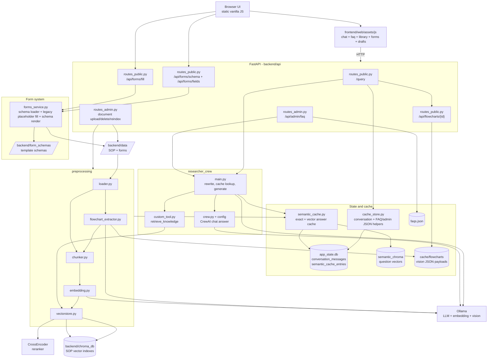

# Backend Topology - ICS SOP & Knowledge Assistant

Topologi komponen utama aplikasi: chat RAG, semantic cache, FAQ, ingestion,
flowchart extraction, document reindex, dan PDF form editor schema-driven.

## Alur Ringkas

- **Frontend**: `frontend/web/assets/app.js` hanya bootstrap state/navigasi; logic utama dipisah ke `assets/js/chat.js`, `forms.js`, `faq.js`, `library.js`, `auth.js`, `storage.js`, `drafts.js`, dan `markdown.js`.
- **Chat**: `/query` mengambil conversation context, rewrite follow-up bila perlu, cek semantic cache, lalu hanya menjalankan retrieval + CrewAI/Ollama jika cache miss.
- **Semantic cache**: payload jawaban ada di `app_state.db`; embedding pertanyaan ada di `backend/cache/semantic_chroma`; cache di-reset setelah reindex.
- **FAQ**: admin membuat FAQ lewat retrieval + Ollama direct, lalu hasil valid disimpan ke `faqs.json`.
- **Form editor PDF**: `assets/js/forms.js` mengambil `GET /api/forms/schema` untuk template yang sudah dimigrasikan, menampilkan preview PDF di client, lalu submit `multipart/form-data` ke `POST /api/forms/fill`. `forms_service.py` merender text, textarea, checkbox, dan signature image langsung ke PDF di memory.
- **Draft form lokal**: `assets/js/storage.js` menyimpan draft field form ke `localStorage`; `assets/js/drafts.js` menampilkan launcher draft di chat supaya user bisa melanjutkan form yang belum selesai.
- **Form fallback lama**: jika schema belum tersedia, frontend masih bisa pakai `GET /api/forms/fields` dan `POST /api/forms/fill` dengan mode placeholder-scan sederhana.
- **Ingestion**: dokumen di `backend/data/` dimuat, flowchart PDF diekstrak bila enabled, teks di-chunk per section, lalu vector DB SOP dibangun ulang.
- **Flowchart**: hasil vision disimpan ke `backend/cache/flowcharts`; screenshot hanya dikirim ke chat jika `FLOWCHART_DISPLAY_ENABLED=true`.
- **Reindex**: upload/update/delete SOP menandai `requires_reindex`; rebuild embeddings membangun index baru dan menghapus semantic cache lama.

Penjelasan per-file detail ada di [BACKEND_FLOW.md](BACKEND_FLOW.md) dan
alur runtime cepat ada di [SYSTEM_FLOWS.md](SYSTEM_FLOWS.md).
