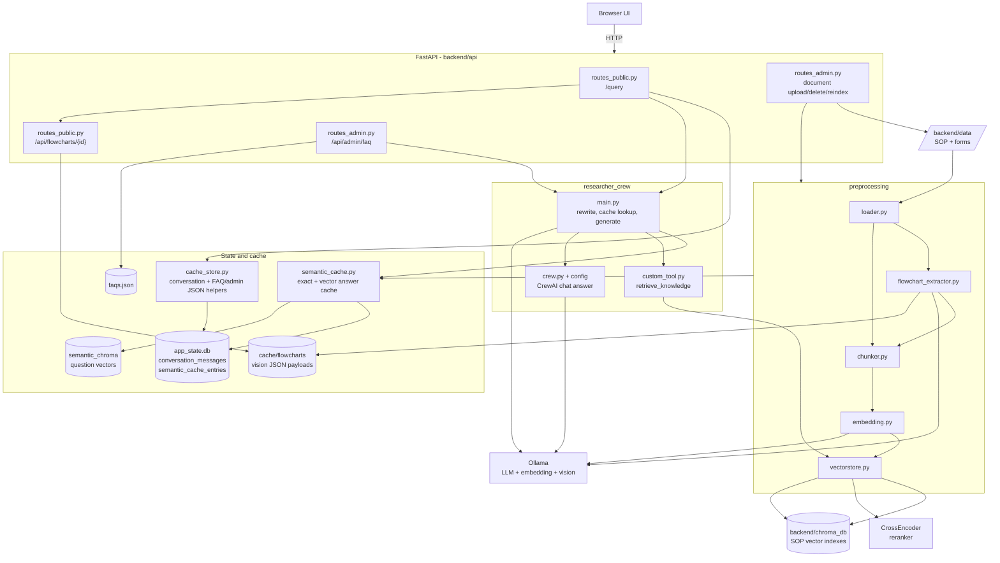

# Backend Topology - ICS SOP & Knowledge Assistant

Topologi komponen backend dan alur data utama: chat, semantic cache, FAQ,
ingestion, flowchart extraction, dan document reindex.

## Alur Ringkas

- **Chat**: `/query` mengambil conversation context, rewrite follow-up bila perlu, cek semantic cache, lalu hanya menjalankan retrieval + CrewAI/Ollama jika cache miss.
- **Semantic cache**: payload jawaban ada di `app_state.db`; embedding pertanyaan ada di `backend/cache/semantic_chroma`; cache di-reset setelah reindex.
- **FAQ**: admin membuat FAQ lewat retrieval + Ollama direct, lalu hasil valid disimpan ke `faqs.json`.
- **Ingestion**: dokumen di `backend/data/` dimuat, flowchart PDF diekstrak bila enabled, teks di-chunk per section, lalu vector DB SOP dibangun ulang.
- **Flowchart**: hasil vision disimpan ke `backend/cache/flowcharts`; screenshot hanya dikirim ke chat jika `FLOWCHART_DISPLAY_ENABLED=true`.
- **Reindex**: upload/update/delete SOP menandai `requires_reindex`; rebuild embeddings membangun index baru dan menghapus semantic cache lama.

Penjelasan per-file detail ada di [BACKEND_FLOW.md](BACKEND_FLOW.md) dan
alur runtime cepat ada di [SYSTEM_FLOWS.md](SYSTEM_FLOWS.md).
