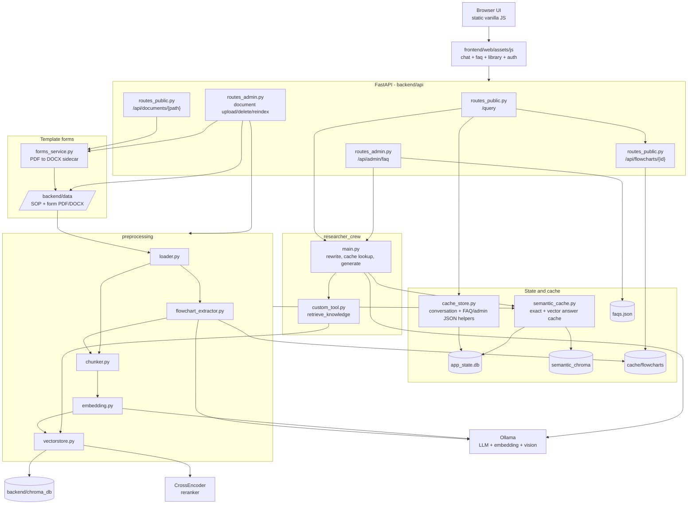

# Backend Topology - ICS SOP & Knowledge Assistant

Topologi komponen utama aplikasi: chat RAG, semantic cache, FAQ, ingestion,
flowchart extraction, document reindex, dan download template form PDF/DOCX.

## Alur Ringkas

- **Frontend**: `app.js` bootstrap state/navigasi; logic utama ada di `chat.js`, `faq.js`, `library.js`, `auth.js`, `api.js`, dan `markdown.js`.
- **Chat**: `/query` mengambil context percakapan, cek semantic cache, retrieval jika cache miss, lalu mengembalikan jawaban, citation, form download, dan flowchart.
- **Form template**: form hanya diunduh sebagai template kosong. Browser membuka modal pilihan format, lalu memanggil `/api/documents/{path}` untuk PDF atau `?format=docx` untuk Word.
- **DOCX sidecar**: saat admin insert/update PDF form, `forms_service.py` membuat file `.docx` pasangan di `backend/data`. Saat PDF form dihapus, pasangan DOCX ikut dihapus.
- **Ingestion**: dokumen non-form di `backend/data/` dimuat, flowchart diekstrak bila enabled, teks di-chunk, lalu vector DB dibangun ulang.
- **Reindex**: upload/update/delete SOP menandai `requires_reindex`; rebuild embeddings membangun index baru dan menghapus semantic cache lama.
