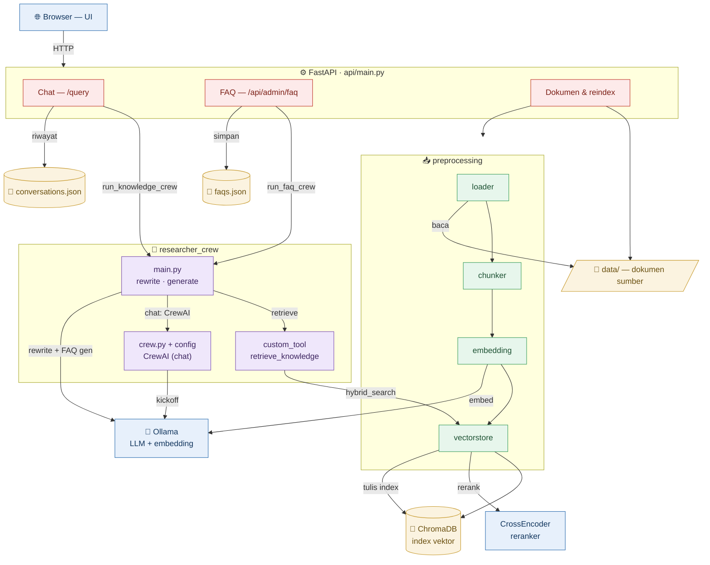

# Backend Topology — ICS SOP & Knowledge Assistant

Topologi komponen backend dan alur data utama (chat, FAQ, ingestion). Render
otomatis di GitHub atau VS Code (ekstensi *Markdown Preview Mermaid*).

## Legenda

| Warna | Komponen |
|---|---|
| 🔵 Biru | Eksternal — Browser, Ollama, Reranker |
| 🔴 Merah | FastAPI (`api/main.py`) — chat, FAQ, dokumen |
| 🟣 Ungu | RAG orchestration (`researcher_crew`) |
| 🟢 Hijau | Pipeline ingestion (`preprocessing`) |
| 🟡 Kuning | Penyimpanan — ChromaDB, cache, dokumen |

## Alur ringkas

- **Chat**: `/query` → `main.py` → rewrite (Ollama) → retrieve (`custom_tool` → `vectorstore` → ChromaDB + reranker) → generate lewat **CrewAI** → simpan riwayat.
- **FAQ**: `/api/admin/faq` → `main.py` → retrieve → generate **Ollama langsung** → simpan ke `faqs.json`.
- **Ingestion**: dokumen di `data/` → loader → chunker → embedding (Ollama) → vectorstore → tulis index ke ChromaDB.

Penjelasan per-file detail ada di [BACKEND_FLOW.md](BACKEND_FLOW.md).
